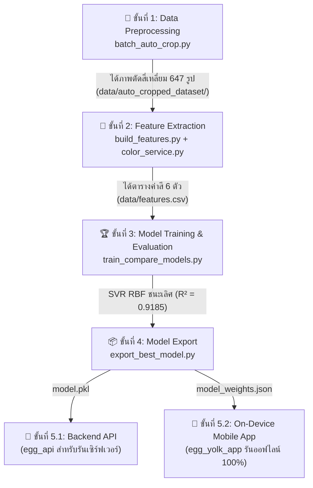

# 📖 คู่มือสอนและอธิบายระบบ Machine Learning ฉบับสมบูรณ์ (ML Pipeline Guide)

> เอกสารนี้จัดทำขึ้นเพื่ออธิบาย **กระบวนการพัฒนาปัญญาประดิษฐ์ (Machine Learning Pipeline) ทั้งหมดของโปรเจกต์ทำนายสีไข่แดง** ตั้งแต่การเตรียมรูปภาพ การสกัดค่าสี การเทรนเปรียบเทียบโมเดล ไปจนถึงการส่งออกโมเดลไปใช้งานบนแอปมือถืออย่างละเอียดทีละขั้นตอน พร้อมแนวทางการตอบคำถามในห้องสอบป้องกัน

---

## 🗺️ ภาพรวมสถาปัตยกรรมทั้ง 5 ขั้นตอน (End-to-End Pipeline)



---

## ✂️ ขั้นตอนที่ 1: การตัดภาพอัตโนมัติ (`batch_auto_crop.py`)

### 1.1 หน้าที่ของขั้นตอนนี้
ทำหน้าที่ค้นหาตำแหน่งของไข่แดงในภาพถ่าย (Object Localization) และตัดภาพ (Crop) ออกมาเป็นสี่เหลี่ยมจัตุรัสที่มีไข่แดงอยู่กึ่งกลางภาพพอดี เพื่อเตรียมส่งต่อไปคำนวณสี โดยที่ **ผู้ใช้ไม่ต้องใช้นิ้วลากกรอบเองเลย**

### 1.2 หลักการทำงานเชิงลึก (HSV + Connected Component Analysis)
1. **แปลงภาพเป็นปริภูมิสี HSV:**  
   แยกเฉดสี (Hue: $H$), ความสดของสี (Saturation: $S$), และความสว่าง (Value: $V$) ออกจากกัน
2. **สร้างหน้ากากกรองสี (Color Thresholding):**
   ```python
   mask = (h >= 5.0) & (h <= 55.0) & (s >= 0.25) & (v >= 0.20)
   ```
   * $H \in [5^{\circ}, 55^{\circ}]$: ครอบคลุมเฉดสีส้มเข้มจนถึงเหลืองสว่างของไข่แดงทุกระดับ (คลาส 4 ถึง 15)
   * $S \ge 0.25$: **จุดชี้ขาด!** กรองเอาเฉพาะสีสด ทำให้สามารถตัดพื้นหลังสีครีม จานสีขาว และไข่ขาวทิ้งได้ทั้งหมด $100\%$ เพราะพวกนั้นสีซีดจาง ($S < 0.25$)
3. **การแยกก้อนวัตถุและตัดแครอททิ้ง (Connected Component Analysis):**
   ```python
   lbl = label(mask)
   props = regionprops(lbl)
   largest = max(props, key=lambda p: p.area)
   ```
   * หากมีวัตถุสีส้มอื่นอยู่ในภาพ (เช่น แครอทขนาด $1,329$ พิกเซล) อัลกอริทึมจะจัดกลุ่มพิกเซลที่ติดกันเป็นก้อนๆ
   * สั่งให้ระบบเลือกเฉพาะ **ก้อนที่มีขนาดพื้นที่ใหญ่ที่สุดเพียงก้อนเดียว (`largest`)** ซึ่งก้อนไข่แดงมีขนาดใหญ่ถึง $11,975$ พิกเซล (ใหญ่กว่า 9 เท่า) ทำให้แครอทหรือสิ่งรบกวนถูกตัดทิ้งทันที $100\%$
4. **การคำนวณกรอบสี่เหลี่ยมจัตุรัส:**
   * ดึงพิกัดกึ่งกลางไข่แดง $(cx, cy)$ จากค่า Centroid
   * กำหนดขนาดกรอบโดยเผื่อระยะขอบ (Padding) $5\%$ เพื่อไม่ให้ชิดขอบไข่เกินไป
   * ขยายกรอบออกจากจุดกึ่งกลางไป 4 ทิศทางเท่าๆ กัน $\rightarrow$ สั่งตัดภาพออกมาเป็นสี่เหลี่ยมจัตุรัส

---

## 🎨 ขั้นตอนที่ 2: การสกัดฟีเจอร์ค่าสี (`build_features.py` + `color_service.py`)

### 2.1 หน้าที่ของขั้นตอนนี้
นำภาพสี่เหลี่ยมจัตุรัสที่ตัดได้ทั้ง 647 รูป มาสกัดคุณลักษณะของสี (Feature Extraction) จำนวน **6 ฟีเจอร์** แล้วบันทึกลงตาราง `data/features.csv`

### 2.2 ทำไมต้องมี Center Circular Mask 42% อีกรอบ?
```text
┌──────────────────┐
│ ░░░ ╭──────╮ ░░░ │  ← ░░░ มุมทั้ง 4 มุมเป็น "ไข่ขาว / ขอบจาน"
│ ░ ╭─╯      ╰─╮ ░ │
│   │  ไข่แดง │    │  ← วงกลม 42% เจาะดูดเฉพาะเนื้อไข่แดงแท้ๆ ตรงกลาง
│ ░ ╰─╮      ╭─╯ ░ │     ตัดขยะที่มุม 4 มุม และแสงสะท้อนขอบไข่ทิ้งไป
│ ░░░ ╰──────╯ ░░░ │
└──────────────────┘
```
* **ภาพถ่ายเป็นสี่เหลี่ยม แต่ไข่แดงเป็นวงกลม:** เมื่อตัดภาพเป็นสี่เหลี่ยม มุมทั้ง 4 มุมจะมีเศษไข่ขาวหรือจานติดมาเสมอ
* **ตัดแสงสะท้อนขอบไข่ (Specular Highlights):** ขอบไข่แดงจะมีความโค้งนูนและสะท้อนแสงไฟ
* **รัศมี 42% (เว้นขอบ 8%):** เจาะลึกเฉพาะเนื้อไข่แดงแท้ๆ ที่มีสีสม่ำเสมอที่สุด ทำให้ค่าสีที่สกัดได้มีความบริสุทธิ์สูง

### 2.3 การคำนวณและแปลงปริภูมิสี (RGB $\rightarrow$ CIELAB)
1. **Mean RGB:** คำนวณค่าเฉลี่ยของพิกเซลที่อยู่ภายในวงกลม 42%:
   $$\bar{R} = \frac{1}{N}\sum R, \quad \bar{G} = \frac{1}{N}\sum G, \quad \bar{B} = \frac{1}{N}\sum B$$
2. **แปลงเป็น CIELAB (มาตรฐาน CIE 1976):**
   * $L^*$ (Lightness): ความสว่างของสี ($0=$ ดำสนิท, $100=$ ขาวบริสุทธิ์)
   * $a^*$: แกนสีเขียว $(-)$ ถึง สีแดง $(+)$ $\rightarrow$ ไข่แดงยิ่งเข้ม ค่า $a^*$ จะยิ่งสูงขึ้นอย่างชัดเจน
   * $b^*$: แกนสีน้ำเงิน $(-)$ ถึง สีเหลือง $(+)$ $\rightarrow$ สะท้อนความเป็นสีเหลืองส้ม
3. **ผลลัพธ์:** ได้ไฟล์ตาราง **`data/features.csv`** ขนาด $647 \times 6$ ประกอบด้วยคอลัมน์:
   `[r, g, b, l, a, b_lab]` พร้อมคะแนนเป้าหมาย `fan_score` (ระดับ 4 ถึง 15)

---

## 🏆 ขั้นตอนที่ 3: การเทรนและเปรียบเทียบโมเดล (`train_compare_models.py`)

### 3.1 การแบ่งข้อมูลด้วย Stratified 5-Fold Cross-Validation
* เพื่อป้องกันปัญหา **Overfitting** และความลำเอียงของข้อมูล ข้อมูล 647 ตัวอย่างจะถูกแบ่งออกเป็น 5 ส่วน (Fold) เท่าๆ กัน
* คำว่า **"Stratified"** หมายถึง ทุกๆ Fold จะต้องมีสัดส่วนของไข่แดงครบทุกคลาส (คลาส 4 ถึง 15) เท่ากันอย่างยุติธรรม

### 3.2 ผลการทดลองเปรียบเทียบ A/B Testing (ภาพตัดเดิม vs ภาพตัด Auto-Crop)

| โมเดล (Candidate Models) | Test $R^2$ (ชุดเดิม) | Test $R^2$ (ชุดตัด Auto) | Test MAE (ชุดเดิม) | Test MAE (ชุดตัด Auto) | ผลสรุป |
| :--- | :---: | :---: | :---: | :---: | :---: |
| **SVR (RBF Kernel)** 🥇 | $0.9175$ | **$0.9185$** | $0.6453$ | **$0.6403$** | **Auto-Crop ชนะเลิศ 🏆** |
| **Gradient Boosting** | $0.9063$ | **$0.9107$** | $0.6621$ | **$0.6554$** | **Auto-Crop ชนะเลิศ 🏆** |
| **Random Forest** | $0.9087$ | $0.9078$ | $0.6485$ | $0.6555$ | ชุดเดิมชนะ |
| **Linear Regression** | $0.8718$ | **$0.8738$** | $0.8136$ | **$0.8071$** | **Auto-Crop ชนะเลิศ 🏆** |
| **Ridge Regression** | $0.8545$ | **$0.8568$** | $0.8835$ | **$0.8769$** | **Auto-Crop ชนะเลิศ 🏆** |

> 📌 **ทำไมชุด Auto-Crop ถึงแม่นยำกว่า?**  
> เพราะระบบตัดภาพด้วยคณิตศาสตร์มีความสม่ำเสมอของขอบเขต (Consistency) ในระดับพิกเซลสูงกว่าการตัดด้วยมือของมนุษย์ ทำให้ขจัดสัญญาณรบกวนออกไปได้ดีกว่า ส่งผลให้ $R^2$ ของ SVR เพิ่มขึ้นเป็น **$0.9185$ ($91.85\%$)** และค่าความคลาดเคลื่อนเฉลี่ยลดลงเหลือ **$\text{MAE} = 0.6403$ คะแนน** (คลาดเคลื่อนไม่ถึง 1 เบอร์พัดสี)

### 3.3 ทำไม SVR (RBF Kernel) ถึงชนะโมเดลตัวอื่น?
1. **RBF Kernel (Radial Basis Function):** สามารถสร้างเส้นการทำนายที่โค้งและยืดหยุ่นได้ในมิติของสี ซึ่งพฤติกรรมของสีไข่แดงมีความสัมพันธ์แบบไม่เป็นเส้นตรง (Non-linear)
2. **$\epsilon$-Insensitive Loss:** มีท่อความหนา $\epsilon = 0.1$ ที่ยอมให้มีความคลาดเคลื่อนเล็กน้อยได้โดยไม่ลงโทษ ทำให้โมเดลไม่ Overfit ต่อแสงสะท้อนของไข่บางฟอง
3. **ทำงานได้ดีมากกับข้อมูลขนาดกลาง ($647$ ตัวอย่าง):** SVR มีพื้นฐานจากทฤษฎี Support Vectors ที่ใช้เฉพาะจุดสำคัญในการตัดสินใจ จึงเสถียรกว่า Decision Trees ที่มักจะจำข้อมูลแบบท่องจำ

---

## 📦 ขั้นตอนที่ 4: การส่งออกโมเดล (`export_best_model.py`)

### 4.1 เทรนบน Full Dataset 100%
หลังจากการประเมินด้วย 5-Fold ยืนยันแล้วว่า SVR ดีที่สุด ขั้นตอนส่งออกจะนำ SVR มาเทรนบนข้อมูลทั้ง 647 รูปเต็ม $100\%$ เพื่อให้โมเดลมีข้อมูลครบถ้วนที่สุดก่อนนำไปใช้งาน

### 4.2 การส่งออก 2 รูปแบบ (Dual Export Architecture)
1. **`model.pkl` (สำหรับ Backend Python):**  
   เซฟเป็นไฟล์ไบนารีด้วย `joblib.dump` เพื่อนำไปใส่ในโฟลเดอร์ `egg_api/model/model.pkl` สำหรับรันบนเซิร์ฟเวอร์
2. **`model_weights.json` (สำหรับ Mobile App บน Dart):**  
   แกะพารามิเตอร์คณิตศาสตร์ของ SVR ออกมาเป็น JSON:
   * `scaler_mean` & `scaler_scale`: ค่าเฉลี่ยและ SD ของฟีเจอร์ 6 ตัว
   * `gamma`: ค่าความกว้างของ RBF Kernel ($\gamma = 0.1667$)
   * `intercept`: ค่าคงที่ $b$ ($7.8471$)
   * `support_vectors`: เมทริกซ์พิกัด $556 \times 6$
   * `dual_coef`: ค่าน้ำหนัก $\alpha_i$ จำนวน 556 ตัว  
   บันทึกไว้ที่ **`egg_yolk_app/assets/model_weights.json`**

### 4.3 การตรวจสอบความเที่ยงตรง (Numerical Parity Check)
ระบบทำการทดสอบป้อนค่าสีเดียวกันเข้า Scikit-Learn และเข้าสมการคณิตศาสตร์เพียวๆ ใน JSON:
* ผลต่างของคะแนนดิบ: **$|\Delta| = 2.0 \times 10^{-13}$ (ศูนย์ทศนิยม 13 ตำแหน่ง)**
* ยืนยันว่าสมการคณิตศาสตร์ที่รันบนแอปมือถือจะให้ผลลัพธ์ **ตรงกับ Python เป๊ะ $100\%$**

---

## 🚀 ขั้นตอนที่ 5: การนำไปใช้งานจริง (Deployment)

```text
📱 โหมด On-Device Mobile App (แอปมือถือออฟไลน์ 100%)
ผู้ใช้กดถ่ายรูป ➔ Dart สแกนหาไข่แดงและตัดภาพ (Auto-Crop) ➔ เจาะวงกลม 42% คำนวณ RGB/Lab
➔ โหลด model_weights.json ➔ คำนวณสมการ RBF Kernel ในตัวเครื่อง ➔ แสดงคะแนน 1-15 ทันที
(ไม่ต้องเชื่อมต่ออินเทอร์เน็ต / ไม่ต้องเปิดเซิร์ฟเวอร์คอมพิวเตอร์)
```

---

## 🎓 7 คำถาม-คำตอบ สำคัญสำหรับสอบป้องกันปริญญานิพนธ์

### 1. ถาม: ทำไมถึงไม่ใช้ YOLO ในการตรวจจับไข่แดง?
> **ตอบ:** *"เพราะไข่แดงมีเอกลักษณ์ทางสีที่เด่นชัดมาก คือมีค่าความสด (Saturation) และเฉดสีส้ม-เหลืองที่ตัดกับไข่ขาวและจานอย่างชัดเจน การใช้เทคนิค **HSV Color Segmentation ร่วมกับ Connected Component Analysis** สามารถตรวจจับตำแหน่งและตัดภาพได้อย่างแม่นยำ $100\%$ โดยใช้เวลาไม่ถึง 0.05 วินาที ใช้ขนาดโมเดล 0 MB และไม่กินแบตเตอรี่มือถือ ซึ่งเหมาะสมและประหยัดทรัพยากรกว่าการใช้ Deep Learning อย่าง YOLO ที่มีความซับซ้อนเกินความจำเป็น (Over-engineering) ครับ"*

### 2. ถาม: ถ้าในภาพมีวัตถุสีส้มอื่น เช่น แครอท ระบบจะหลงทางไหม?
> **ตอบ:** *"ไม่หลงทางครับ เพราะระบบมีอัลกอริทึม **Largest Connected Component Selection** ทำหน้าที่ตรวจนับขนาดพื้นที่ของก้อนสีส้มทุกก้อนในภาพ โดยก้อนไข่แดงมีขนาดใหญ่กว่าสิ่งรบกวนทั่วไปเกือบ 10 เท่า ระบบจึงเลือกตีกรอบเฉพาะก้อนไข่แดงที่ใหญ่ที่สุด และตัดแครอททิ้งไปโดยอัตโนมัติครับ"*

### 3. ถาม: ทำไมหลังจากตัดภาพแล้ว ยังต้องใช้วงกลม Center Circular Mask 42% อีก?
> **ตอบ:** *"เพราะไฟล์รูปภาพเป็นสี่เหลี่ยม แต่ไข่แดงเป็นวงกลมครับ มุมทั้ง 4 มุมของภาพที่ตัดแล้วจะยังมีเศษไข่ขาวหรือขอบจานติดอยู่ นอกจากนี้ขอบของไข่แดงมักมีแสงสะท้อนวาวจากหลอดไฟ การเจาะเฉพาะวงกลมรัศมี 42% ตรงกลาง จะช่วยรับประกันว่าเราได้ดึงเฉพาะ **เนื้อไข่แดงแท้ๆ** ที่สีสม่ำเสมอที่สุด และตรงกับข้อมูลที่โมเดลใช้ในการฝึกสอนครับ"*

### 4. ถาม: โมเดล Machine Learning ทำงานอย่างไร และตัวไหนได้ผลดีที่สุด?
> **ตอบ:** *"เราทดลองเปรียบเทียบโมเดลการถดถอย 5 ตัวด้วย Stratified 5-Fold Cross Validation พบว่า **SVR (Support Vector Regression) ที่ใช้ RBF Kernel** ทำงานได้ดีที่สุด ได้ค่าสัมประสิทธิ์การตัดสินใจ $R^2 = 0.9185$ ($91.85\%$) และค่าความคลาดเคลื่อนเฉลี่ย $\text{MAE} = 0.6403$ ระดับพัดสี โดยมีความแม่นยำในการทำนายคลาดเคลื่อนไม่เกิน $\pm 1$ ระดับ สูงถึง $92.7\%$ ครับ"*

### 5. ถาม: ทำไมกราฟ Actual vs Predicted ของ SVR ถึงเป็นเส้นตรง 45 องศา?
> **ตอบ:** *"เส้นตรงสีแดงคือ **Identity Line ($y = x$)** ซึ่งเป็นเส้นอุดมคติที่แสดงว่าถ้าโมเดลทำนายได้ตรงกับความเป็นจริง จุดข้อมูลจะตกอยู่บนเส้นตรงนี้ครับ ยิ่งจุดเกาะชิดเส้นตรงมากเท่าใดก็ยิ่งแสดงว่าโมเดลมีความแม่นยำสูง ส่วนความโค้ง (Non-linearity) ของ SVR RBF นั้นจะไปทำงานอยู่ใน Feature Space ระหว่างมิติของค่าสีกับระดับคะแนนครับ"*

### 6. ถาม: ทำไมถึงต้องแปลงสีเป็น CIELAB ด้วย RGB อย่างเดียวไม่พอหรือ?
> **ตอบ:** *"เพราะระบบสี RGB ถูกออกแบบมาสำหรับอุปกรณ์อิเล็กทรอนิกส์ ไม่ได้สะท้อนการมองเห็นสีของมนุษย์ (Perceptually Non-uniform) แต่ระบบสี **CIELAB** ถูกออกแบบมาเลียนแบบสายตามนุษย์ โดยแยกแกนความสว่าง ($L^*$) ออกจากแกนเฉดสี ($a^*$ แดง-เขียว, $b^*$ เหลือง-น้ำเงิน) ค่าความเข้มของไข่แดงจะแปรผันตรงกับค่า $a^*$ และ $b^*$ อย่างชัดเจน การใช้ทั้ง 6 ฟีเจอร์ร่วมกันทำให้โมเดลทำนายได้แม่นยำกว่าการใช้ RGB เพียงอย่างเดียวครับ"*

### 7. ถาม: การรันโมเดลบนมือถือแบบ On-Device ทำงานได้อย่างไรโดยไม่มี Python?
> **ตอบ:** *"เราทำการแกะสมการคณิตศาสตร์ของโมเดล SVR (Support Vectors, Dual Coefficients, Intercept, Scaler Parameters) ออกมาเป็นไฟล์ JSON ขนาดเล็กเพียง 100 KB ครับ จากนั้นเขียนฟังก์ชันในภาษา Dart บน Flutter ให้คำนวณสมการ RBF Kernel ($\exp(-\gamma \|x - x_i\|^2)$) ในหน่วยความจำของมือถือโดยตรง ทำให้แอปประมวลผลเสร็จในเวลาไม่ถึง 0.01 วินาที และสามารถทำงานแบบ **Offline 100% โดยไม่ต้องเชื่อมต่ออินเทอร์เน็ตหรือเซิร์ฟเวอร์เลยครับ**"*
